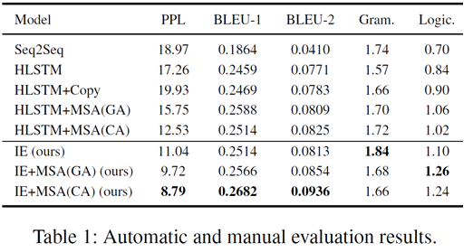

# Story Ending Generation with Incremental Encoding and Commonsense Knowledge

## Introduction

Generating a reasonable ending for a given story context, i.e., story ending generation, is a strong indication of story comprehension. This task requires not only to understand the context clues which play an important role in planning the plot, but also to handle implicit knowledge to make a reasonable, coherent story. In this paper, we devise a novel model for story ending generation. The model adopts an incremental encoding scheme to represent context clues which are spanning in the story context. In addition, commonsense knowledge is applied through multi-source attention to facilitate story comprehension, and thus to help generate coherent and reasonable endings. Through building context clues and using implicit knowledge, the model is able to produce reasonable story endings.

This project is a tensorflow implementation of our work.

## Dependencies

- Python 2.7
- Numpy 1.14.5
- Tensorflow 1.0.1
- Pattern 2.6

## Quick Start

- Dataset

  Our dataset contains five-sentence stories from [ROCStories corpus](http://cs.rochester.edu/nlp/rocstories/) (Note that we just split the training data of the original corpus into the new training and testing set) and corresponding commonsense knowledge graphs retrieved from [ConceptNet](http://www.conceptnet.io/).  And only those relations occurring in the dataset is retained.

  Please download the pre-trained word vectors [Glove](https://nlp.stanford.edu/projects/glove/) to data directory. And in our experiments glove.6B.200d.txt (dimension of word embedding is 200) is adopted.

- Train

  ```python
  python main.py
  ```

- Test

  ```shell
  python main.py --is_train=False --inference_path='xxx' --inference_version='yyy'
  ```

  You can test the model using this command. You may set the directory of test set with **inference_path** and the checkpoint to be used with **inference_version**. The generation result will be output to the 'xxx/output_yyy.txt' file.

## Details

### Training

You can change the model parameters using:

```
--symbols xxx			size of full vocabulary (default 10,000)
--units xxx 			size of hidden units (default 200)
--embed_units xxx		dimension of word embedding (default 200)
--batch_size xxx 		batch size in training process (default 128)
--per_checkpoint xxx		steps to save and evaluate the model (default 1,000)
--layers xxx			number of layers of RNN (default 2)
--triple_num xxx		max number of triple for each query (default 10)
--data_dir xxx			data directory (default "./data")
--train_dir xxx			training directory (default "./train")
--is_train xxx			whether to inference (default True)
--log_parameters xxx		whether to show the parameters (default True)
--inference_version xxx		the version of checkpoint (default 0)
--inference_path xxx		the output path of inference (default "")
```

## Paper

Jian Guan*, Yansen Wang*, Minlie Huang. Story Ending Generation with Incremental Encoding and Commonsense Knowledge. In AAAI, Honolulu, USA [Preprint paper](https://arxiv.org/abs/1808.10113)

Concat info : guanj15@mails.tsinghua.edu.cn

## Main Results
Note that there is something wrong with bleu-2 in the result reported in the paper.


